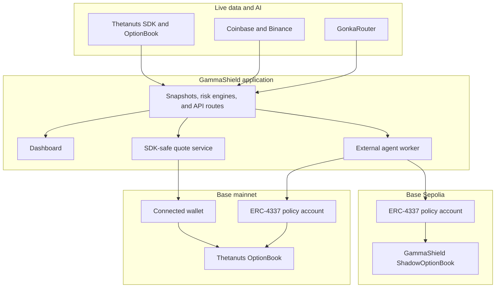

# GammaShield

<p align="center">
  
</p>

<p align="center">
  <a href="https://nextjs.org/"></a>
  <a href="https://www.typescriptlang.org/"></a>
  <a href="https://www.base.org/"></a>
  <a href="https://thetanuts.finance/"></a>
  <a href="https://www.erc4337.io/"></a>
</p>

**GammaShield** is an options-risk terminal for Base. It reads the live Thetanuts BTC and ETH OptionBook, explains market-structure risk, prepares wallet-reviewed fills, and provides a policy-bound autonomous hedge demonstration through ERC-4337 smart accounts.

> GammaShield is a hackathon project for research and demonstration. It is not investment advice. Base Sepolia Shadow positions are GammaShield test receipts, not live Thetanuts positions.

## Table of Contents

- [Project Overview](#project-overview)
- [Installation Guide](#installation-guide)
- [Project Structure](#project-structure)
- [Environment Variables](#environment-variables)
- [System Architecture](#system-architecture)
- [Tech Stack](#tech-stack)
- [Core Features](#core-features)
- [Essential Commands](#essential-commands)

## Project Overview

GammaShield keeps three concerns separate:

- **Market structure:** a book-level engine measures dealer gamma, liquidity, strike concentration, expiry pressure, and implied volatility from live Thetanuts data.
- **Trade and position risk:** a separate per-contract model evaluates an individual option or structure, while a market-impact model explains dealer hedging flow from a potential fill.
- **Execution authority:** users retain normal wallet control for live OptionBook fills. The policy-account flow is restricted by a user-signed mandate, ERC-4337 smart account, short-lived risk evidence, caps, cooldowns, and pause/revoke controls.

The dashboard supports live BTC and ETH options data on Base mainnet, a Base Sepolia Shadow environment for end-to-end test-fund flows, GonkaRouter AI explanations, rumor verification, strategy suggestions, live charts, and wallet-scoped positions.

### Implemented and verified

- Live Thetanuts OptionBook reads, normalized server-side through the official SDK.
- SDK-previewed listed-order fills with exact approval and a separate wallet confirmation step.
- EIP-712 mandate signing and ERC-4337 policy-account controls for the agent flow.
- Base Sepolia Shadow fill, close, and roll receipts with UserOperation receipt tracking.
- Explicit labels for live, modeled, RFQ-only, cached, Shadow, and deterministic-AI-fallback data.
- Automated checks for the risk engine, market-impact model, autonomous-policy engine, Solidity contracts, production build, linting, and EIP-170 contract-size limits.

## Installation Guide

### Prerequisites

- Node.js 20 or later
- npm
- A browser wallet such as MetaMask
- [Foundry](https://book.getfoundry.sh/getting-started/installation) for contract tests and deployments
- Accounts/API keys for:
  - [GonkaRouter dashboard](https://gonkarouter.io/dashboard)
  - A Base RPC provider, such as [Alchemy Base](https://dashboard.alchemy.com/chains/base) or Infura
  - [Pimlico API keys](https://dashboard.pimlico.io/apikeys) for ERC-4337 bundling

### Install the application

```bash
git clone <repository-url>
cd GammaShield
npm install
cp .env.example .env.local
npm run dev
```

Open [http://localhost:3000](http://localhost:3000).

### Configure a Base RPC

1. Create a Base Mainnet HTTPS endpoint in [Alchemy's Base dashboard](https://dashboard.alchemy.com/chains/base), or create an equivalent Base endpoint with Infura.
2. Add it to `.env.local`:

```bash
BASE_RPC_URL=https://base-mainnet.example-rpc-provider.com/v2/<key>
BASE_SEPOLIA_RPC_URL=https://base-sepolia.example-rpc-provider.com/v2/<key>
```

### Configure GonkaRouter

1. Create an API key in the [GonkaRouter dashboard](https://gonkarouter.io/dashboard).
2. Add it to `.env.local`:

```bash
GONKAROUTER_API_KEY=<your-key>
GONKAROUTER_BASE_URL=https://api.gonkarouter.io/v1
GONKAROUTER_MODEL=deepseek-ai/DeepSeek-V4-Flash-0731
```

GonkaRouter powers optional AI narration, policy drafting, strategy commentary, and rumor verification. If it is unavailable, GammaShield shows a clearly labelled deterministic result rather than presenting it as AI output.

### Configure Pimlico for policy-account UserOperations

1. Create a Bundler API key in the [Pimlico dashboard](https://dashboard.pimlico.io/apikeys).
2. Add it to `.env.local`:

```bash
PIMLICO_API_KEY=pim_<your-key>
```

Pimlico is used as a bundler for ERC-4337 UserOperations. It does not replace the policy account's on-chain limits.

### Base Sepolia Shadow setup

The Shadow environment uses Base Sepolia ETH and test USDC. It demonstrates policy-bound fills, closes, rolls, and monitoring without representing live Thetanuts positions.

1. Set a dedicated quote/deployment signer and give it enough Base Sepolia ETH to deploy contracts:

```bash
SHADOW_QUOTE_SIGNER_PRIVATE_KEY=<dedicated-test-key>
```

2. Deploy the Shadow book and policy-account factory:

```bash
npm run deploy:sepolia:shadow
```

3. Copy the printed addresses and deployment blocks into `.env.local`:

```bash
NEXT_PUBLIC_BASE_SEPOLIA_MANDATE_FACTORY_ADDRESS=<factory-address>
NEXT_PUBLIC_BASE_SEPOLIA_SHADOW_OPTION_BOOK_ADDRESS=<shadow-book-address>
NEXT_PUBLIC_BASE_SEPOLIA_AGENT_ADDRESS=<attester-address>
SHADOW_OPTION_BOOK_ADDRESS=<shadow-book-address>
SHADOW_DEPLOYMENT_BLOCK=<shadow-book-deployment-block>
BASE_SEPOLIA_MANDATE_FACTORY_DEPLOYMENT_BLOCK=<factory-deployment-block>
```

4. Generate an endpoint secret and configure the worker:

```bash
openssl rand -hex 32
```

```bash
SHADOW_AGENT_CRON_SECRET=<generated-secret>
SHADOW_AGENT_URL=http://localhost:3000
SHADOW_AGENT_INTERVAL_SECONDS=15
```

5. Start the Shadow worker in a second terminal:

```bash
npm run agent:shadow
```

For restart-safe UserOperation tracking, mount `SHADOW_AGENT_STATE_PATH` on persistent storage when the worker runs outside your local machine.

### Base mainnet policy-account setup

Use a **dedicated, minimally funded agent wallet**, never a personal wallet key. This key signs short-lived risk and quote attestations and deploys the factory; it is server-only.

```bash
BASE_AGENT_PRIVATE_KEY=<dedicated-agent-key>
npm run deploy:base:policy
```

Copy the command output into `.env.local`:

```bash
NEXT_PUBLIC_BASE_MANDATE_FACTORY_ADDRESS=<factory-address>
NEXT_PUBLIC_BASE_AGENT_ADDRESS=<agent-address>
BASE_MANDATE_FACTORY_DEPLOYMENT_BLOCK=<factory-deployment-block>
```

Configure the worker and leave broadcasting disabled until deliberately activating it:

```bash
BASE_AGENT_CRON_SECRET=<generated-secret>
BASE_AGENT_URL=http://localhost:3000
BASE_AGENT_INTERVAL_SECONDS=15
BASE_AGENT_DRY_RUN=true
```

Run the mainnet monitor in a separate terminal:

```bash
npm run agent:thetanuts
```

`BASE_AGENT_DRY_RUN=true` validates policy-bound UserOperations without broadcasting. Only `false` enables broadcasting.

## Project Structure

```text
app/
  api/                         Server routes for market data, quotes, positions, AI, and agents
  page.tsx                     Application entry point
components/
  Dashboard.tsx                Main dashboard composition
  TradePanel.tsx               Wallet-reviewed mainnet and Shadow trade flow
  MandateSigningPanel.tsx      EIP-712 mandate and agent controls
  PolicyAccountPanel.tsx       ERC-4337 account deployment and funding
  AgentMonitoringPanel.tsx     Worker, policy, risk-evidence, and UserOperation status
  ContractRiskPanel.tsx        Per-contract risk explanation
  MarketImpactPanel.tsx        Dealer hedge-flow and market-impact explanation
contracts/
  src/MandateAccount.sol       ERC-4337 account and policy enforcement
  src/ShadowOptionBook.sol     Base Sepolia test-receipt book
  test/                        Foundry contract tests
lib/
  snapshot.ts                  Live Thetanuts book normalization and market snapshot
  engine.ts                    Pure book-level market-structure risk engine
  contractRisk.ts              Pure per-contract risk engine
  marketImpact.ts              Pure dealer-flow market-impact model
  trade.ts                     SDK-safe listed-order preview and calldata preparation
  autonomous/                  Policy, decision, thesis, trend, trigger, and AI guard logic
  shadowAgent.ts               Base Sepolia policy-bound agent runner
  thetanutsAgent.ts            Base mainnet Thetanuts policy-bound runner
  generated/contracts.ts       wagmi-generated contract ABI/hooks
scripts/
  shadow-agent-worker.mjs      Persistent external worker and UserOperation journal
  *-self-check.mts             Runnable model and policy checks
public/
  gammashield-lockup.png       GammaShield logo
```

## Environment Variables

Copy `.env.example` to `.env.local`. Do not commit `.env.local` or expose any server-only values to the browser.

### Server-only variables

| Variable | Required for | Purpose |
| --- | --- | --- |
| `BASE_RPC_URL` | Mainnet market data and policy agent | Base Mainnet RPC for the Thetanuts SDK and contract reads. |
| `BASE_SEPOLIA_RPC_URL` | Shadow mode | Base Sepolia RPC. |
| `GONKAROUTER_API_KEY` | Gonka AI features | Server-side GonkaRouter authentication. |
| `GONKAROUTER_BASE_URL` | Gonka AI features | Defaults to `https://api.gonkarouter.io/v1`. |
| `GONKAROUTER_MODEL` | Gonka AI features | GonkaRouter model identifier. |
| `PIMLICO_API_KEY` | ERC-4337 worker | Pimlico Bundler API key. |
| `BASE_AGENT_PRIVATE_KEY` | Base mainnet policy agent | Dedicated agent/deployment key; never use a personal key. |
| `SHADOW_QUOTE_SIGNER_PRIVATE_KEY` | Shadow deployment and quotes | Dedicated Base Sepolia test signer. |
| `BASE_AGENT_CRON_SECRET` | Mainnet worker API | Bearer secret for `/api/thetanuts/agent`. |
| `SHADOW_AGENT_CRON_SECRET` | Shadow worker API | Bearer secret for `/api/shadow/agent`. |
| `BASE_AGENT_URL` / `SHADOW_AGENT_URL` | External workers | Public origin of the running GammaShield app. |
| `BASE_AGENT_INTERVAL_SECONDS` | Mainnet worker | Poll interval; use 10–15 seconds. |
| `SHADOW_AGENT_INTERVAL_SECONDS` | Shadow worker | Poll interval; use 10–60 seconds. |
| `BASE_AGENT_STATE_PATH` / `SHADOW_AGENT_STATE_PATH` | External workers | Persistent UserOperation journal path. |
| `BASE_AGENT_DRY_RUN` | Mainnet worker | Keep `true` to validate without broadcasting; only `false` broadcasts. |
| `ENABLE_RFQ_EXECUTION` | RFQ execution | Keep `false` unless the separate RFQ lifecycle is deliberately enabled. |

### Public configuration variables

Variables prefixed with `NEXT_PUBLIC_` are compiled into the browser bundle. They must contain public addresses or URLs only. Restart the development server after changing them.

| Variable | Purpose |
| --- | --- |
| `NEXT_PUBLIC_BASE_MANDATE_FACTORY_ADDRESS` | Base mainnet policy-account factory address. |
| `NEXT_PUBLIC_BASE_AGENT_ADDRESS` | Public Base mainnet agent/attester address. |
| `NEXT_PUBLIC_BASE_SEPOLIA_MANDATE_FACTORY_ADDRESS` | Base Sepolia policy-account factory address. |
| `NEXT_PUBLIC_BASE_SEPOLIA_SHADOW_OPTION_BOOK_ADDRESS` | Base Sepolia Shadow receipt-book address. |
| `NEXT_PUBLIC_BASE_SEPOLIA_SHADOW_USDC_ADDRESS` | Base Sepolia test-USDC address. |
| `NEXT_PUBLIC_BASE_SEPOLIA_AGENT_ADDRESS` | Public Base Sepolia Shadow attester address. |
| `NEXT_PUBLIC_BASE_EXPLORER_URL` | Base explorer URL, normally `https://basescan.org`. |
| `NEXT_PUBLIC_BASE_SEPOLIA_EXPLORER_URL` | Base Sepolia explorer URL. |
| `NEXT_PUBLIC_ENABLE_RFQ_EXECUTION` | Browser-side RFQ UI flag; keep aligned with `ENABLE_RFQ_EXECUTION`. |

### Market-data and deployment values

| Variable | Purpose |
| --- | --- |
| `SHADOW_USDC_ADDRESS` | Test USDC used to deploy the Shadow book. |
| `SHADOW_CHAIN_ID` | Base Sepolia chain ID; use `84532`. |
| `SHADOW_OPTION_BOOK_ADDRESS` | Server-side Shadow book address. |
| `SHADOW_DEPLOYMENT_BLOCK` | Shadow book deployment block for indexed reads. |
| `BASE_MANDATE_FACTORY_DEPLOYMENT_BLOCK` | Base mainnet factory deployment block for agent discovery. |
| `BASE_SEPOLIA_MANDATE_FACTORY_DEPLOYMENT_BLOCK` | Base Sepolia factory deployment block for agent discovery. |
| `COINBASE_WS_URL` | Coinbase WebSocket spot-price feed. |
| `COINBASE_API_URL` | Coinbase candle API. |
| `BINANCE_API_URL` | Binance candle fallback. |

## System Architecture



### Execution model

1. The server reads the live Thetanuts book and spot-market feeds.
2. Pure risk engines derive market structure, per-contract risk, and market impact.
3. For a normal live trade, the browser refreshes a listed order, previews it with the SDK, approves the exact amount, and submits the fill through the connected wallet.
4. For the policy-account flow, the owner deploys a deterministic smart account, signs an EIP-712 mandate, funds it, and can pause or revoke it.
5. The external worker checks live risk and the latest eligible book state, then submits permitted policy-bound ERC-4337 UserOperations through Pimlico. Every execution remains constrained by the on-chain mandate.

## Tech Stack

| Area | Technologies |
| --- | --- |
| Web application | Next.js 16, React 19, TypeScript, Tailwind CSS 4 |
| Wallet integration | wagmi 3, viem 2, ethers 6 |
| Options data and execution | `@thetanuts-finance/thetanuts-client` on Base |
| Smart accounts | Solidity, ERC-4337 v0.7, EIP-712, Foundry |
| UserOperation bundling | Pimlico Bundler |
| AI | GonkaRouter |
| Charts | lightweight-charts, ECharts |
| Market data | Thetanuts, Coinbase, Binance |

## Core Features

### Live market-risk terminal

- Live BTC and ETH Thetanuts OptionBook data on Base.
- Dealer-gamma regime, gamma-flip level, expiry buckets, strike concentration, depth, and volatility analysis.
- Coinbase WebSocket price stream with server-side exchange fallbacks for market data.
- Clear separation between live, cached, modeled, and unavailable values.

### Trade review and execution safety

- Official Thetanuts SDK for listed-order selection, previewing, approval encoding, and fill calldata.
- Correct asset, option side, maker direction, expiry, collateral, implementation, and known OptionBook-target validation.
- Exact approval instead of unlimited allowance, with approval and fill kept as separate wallet actions.
- RFQ-only estimates are visible but never treated as instant executable quotes.

### Risk and strategy intelligence

- Independent book-level and per-contract risk models, so a market regime score is never confused with position risk.
- Market-impact model that distinguishes the immediate dealer delta hedge from future gamma-feedback flow.
- GonkaRouter AI narration, policy drafting, strategy explanations, and multi-model rumor checking.
- Explicit deterministic fallback labels whenever an AI response is unavailable.

### Policy-bound autonomous hedge flow

- Deterministic ERC-4337 policy accounts with predictable addresses.
- Owner-signed EIP-712 mandate covering asset, side, premium caps, trade-size cap, tenor, risk triggers, persistence, cooldown, expiry, and nonce.
- On-chain pause/revoke controls, premium accounting, fresh risk attestations, and UserOperation validation.
- Dedicated Base Sepolia Shadow environment for test-fund fills, closes, rolls, and position receipts.
- Agent monitoring with policy evidence, worker state, UserOperation receipts, decisions, rejected alternatives, and explicit mainnet recommendation-only exits.

### Traceability

- Explorer links for wallet addresses, policy accounts, deployments, transactions, fills, and confirmed UserOperations.
- Generated wagmi ABI/hooks from the Solidity contracts.
- Separate Base mainnet and Base Sepolia network controls throughout the UI.

## Essential Commands

| Command | Purpose |
| --- | --- |
| `npm run dev` | Start the local Next.js development server. |
| `npm run dev:https` | Start local development over HTTPS for wallet testing. |
| `npm run build` | Create a production build. |
| `npm run start` | Serve the production build. |
| `npm run lint` | Run ESLint. |
| `npm run typecheck` | Run strict TypeScript checking. |
| `npm run check:risk` | Run the per-contract risk-model self-check. |
| `npm run check:impact` | Run the market-impact-model self-check. |
| `npm run check:agent` | Run autonomous policy, decision, trend, and thesis checks. |
| `npm run check:mandate` | Run EIP-712 mandate checks. |
| `npm run check:strategy` | Run strategy-engine checks. |
| `cd contracts && forge test` | Run Solidity tests for policy accounts and Shadow book. |
| `npm run check:sizes` | Enforce EIP-170 contract-size limits before deployment. |
| `npm run wagmi:generate` | Regenerate typed ABI/hooks after contract changes. |
| `npm run deploy:sepolia:shadow` | Deploy the Base Sepolia Shadow book and policy factory. |
| `npm run deploy:base:policy` | Deploy the Base mainnet policy-account factory. |
| `npm run agent:shadow` | Run the persistent Base Sepolia Shadow worker. |
| `npm run agent:thetanuts` | Run the persistent Base mainnet Thetanuts worker. |

Before changing contracts, run:

```bash
cd contracts && forge test
cd .. && npm run check:sizes
```

Before merging application changes, run:

```bash
npm run lint
npm run build
```
